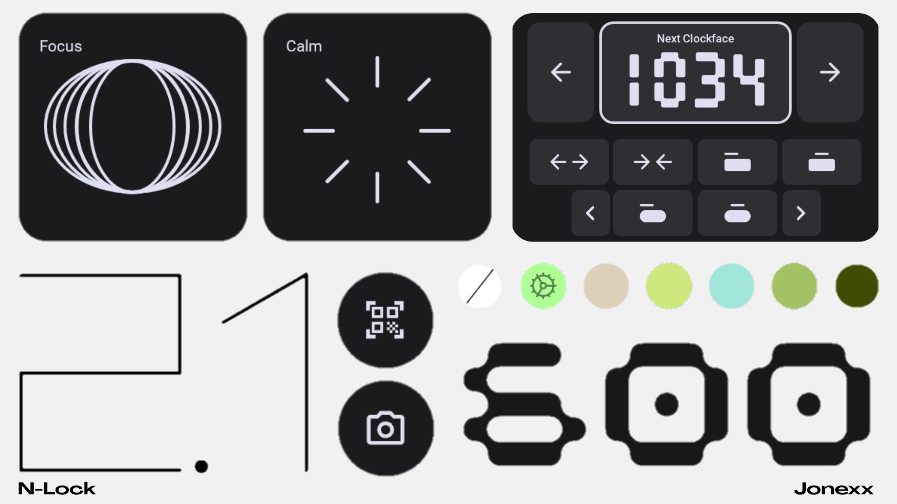

  

<h1 align="center">N-LOCK 1.0</h1>

Nothing OS inspired Lockscreen for **KLCK Kustom Lock Screen Maker**.

---

## 📱 What's New in V2.1

* **Introducing fully customizable lockscreen widgets**: Select between 7 predefined lockscreen widget packs featuring adaptive dark/light themes.

* **Introducing shortcuts selection**: You can now select up to 6 shortcut icons for the left and right sides.

* **Added on-screen color selection**: Customize your clock color directly from the lock screen without unlocking your phone (note: applying custom accent colors requires unlocking your device).

* **Expanded clockface collection**: Added 4 new clockfaces inspired by the authentic Nothing OS system aesthetics.

* **Added lockscreen notification list**: Integrated a dedicated notification list directly onto the lock screen (previously unavailable in v1.0).

* **View full changelog in releases page**

---

## 🛠️ Requirements & Setup

1. **KLCK Kustom Lock Screen Maker** (Pro Key required to load presets).
2. Download `N-Lock_2.1.klck` (or install the APK release) from the [Releases](https://github.com/) section.
3. Open KLCK, grant all required permissions:
   * **Notification Access**
   * **Draw Over Apps**
   * **Battery Optimization:** Set to *Unrestricted* to prevent background kills.
4. Load **N-Lock 2.1** and hit Save!

---

## 📩 Support & Bug Reports

If you find any bugs related to icons, fonts, or animations, feel free to open an issue or reach out directly:

* **WhatsApp:** +52 997 183 9718
 
* **Ecosystem:** You can use **NOOS Widgets** for the full Nothing OS experience, get NOOS [Here](https://github.com/Jonexk/NOOS-Widgets)
* 

---
*Created by **-Jonexx**. Designed for the Android customization community.*
